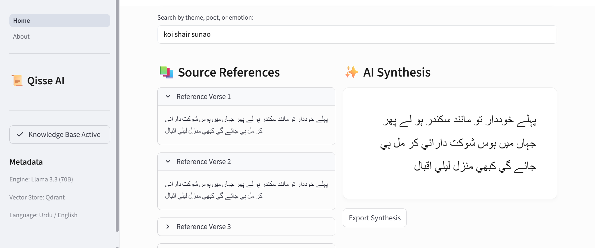
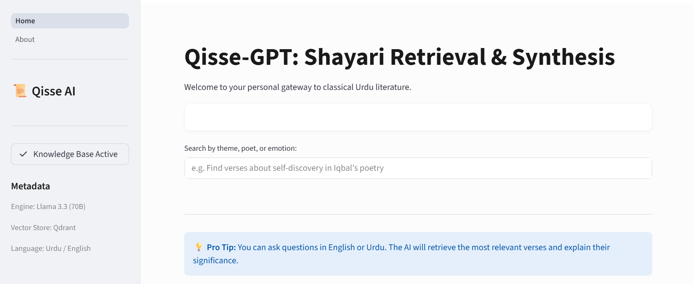

# Qisse AI (قصہ) 📜
### *Bridging Classical Urdu Literature with Modern Generative Intelligence*
<p align="center">
  
</p>

[](https://groq.com/)
[](https://qdrant.tech/)
[](https://www.langchain.com/)
[](https://opensource.org/licenses/MIT)

**Qisse AI** is a specialized RAG (Retrieval-Augmented Generation) system designed to navigate and interpret the vast world of Urdu poetry. By combining the linguistic depth of Llama 3.3 with a high-performance vector retrieval layer, Qisse AI provides contextually aware answers, thematic analysis, and poetic discovery.
<p align="center">
  
</p>

---


## 🚀 Key Features

- **High-Speed Inference:** Leveraging **Groq's LPU™ technology** and Llama 3.3 for near-instant response times.
- **Contextual Literary Search:** Powered by **Qdrant**, allowing for semantic retrieval of verses based on themes (e.g., *ishq, gham, falsafa*) rather than just keywords.
- **Dual-Language Interface:** Seamless support for Urdu and English queries through a Streamlit-powered web dashboard.
- **Advanced Embeddings:** Utilizing `all-MiniLM-L6-v2` for efficient and accurate vectorization of the Urdu Poetry Database.

---

## 🛠️ Technical Architecture

Qisse AI follows a modular RAG pipeline:

1.  **Data Ingestion:** Processing the Urdu Poetry Database via LangChain loaders.
2.  **Vectorization:** Embedding text into a 384-dimensional space using Hugging Face models.
3.  **Storage:** Persistence in **Qdrant** for scalable vector similarity search.
4.  **Generation:** Groq-hosted Llama 3.3 synthesizes the retrieved context into elegant, human-like responses.

```mermaid
graph LR
    A[User Query] --> B[Hugging Face Embeddings]
    B --> C{Qdrant Vector DB}
    C --> D[Retrieved Verses]
    D --> E[Groq Llama 3.3]
    E --> F[Final Response]